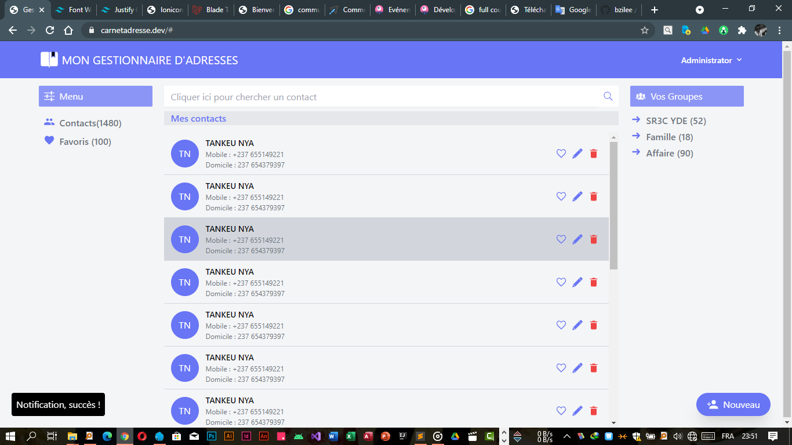

# address-manager

An Address Manager (phone contacts and emails) built with Laravel + Livewire + TailwindCSS

## Capture d'écran (Home page screenshot)

<p align="center">
    </a>
</p>

## System Requirement

* Web Server as:
  - Apache 2.4.x or higher with rewrite engine on (mod_rewrite)  
  - Nginx 1.11.x or higher
* Database that laravel supports, actually can be:
  - MySQL 5.7 (For index length size)
* Composer
* Git
* NodeJS 6.x or higher
* PHP 7.1.x or higher and the extensions:

* Set up the required ENV variables, the more you set up the better though
  - `DB_CONNECTION`
  - `DB_HOST`
  - `DB_PORT`
  - `DB_USERNAME`
  - `DB_PASSWORD`

## Installation and Configuration
* Fork the repository & clone it to your host machine

    ```shell
    $ git clone https://github.com/bzilee/address-manager.git
    ```

* Change to the root of your application's directory and install dependencies

    ```shell
    $ cd address-manager
    $ composer install
    $ npm install 
    ```

* Make a copy of the `.env.example` file  and name it `.env`

    ```shell
    $ cp .env.example .env
    ```

* Set up your database and enter the credentials in the `.env` file

    ```
    DB_CONNECTION=
    DB_HOST=
    DB_PORT=
    DB_DATABASE=
    DB_USERNAME=
    DB_PASSWORD=
    ```

* Generate a new application key using `artisan`

    ```shell
    $ php artisan key:generate
    $ php artisan migrate
    $ npm run watch 
    ```

* Create the first user in Database

    ```shell
    use link : your-server-domain/register to create a user 
    ```

## Perspectives

- Responsive Design for mobile devices
- Search for contacts using the search bar
- Group creation
- Adding new contacts
- Verification of user data
- Some interface adjustments

## License

The Laravel framework is open-sourced software licensed under the [MIT license](https://opensource.org/licenses/MIT).